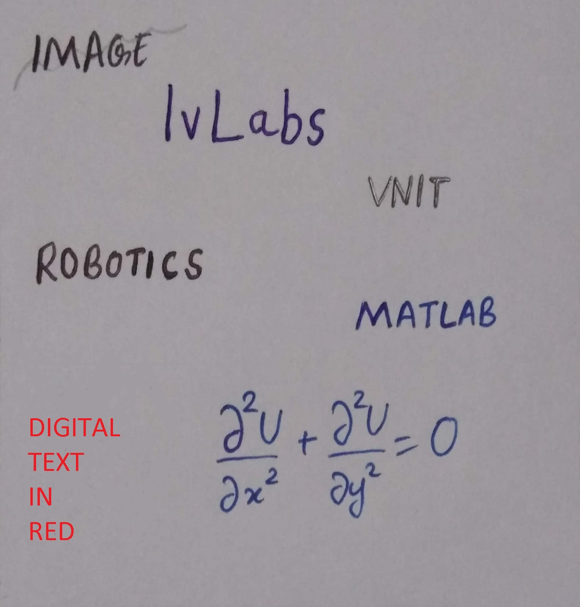
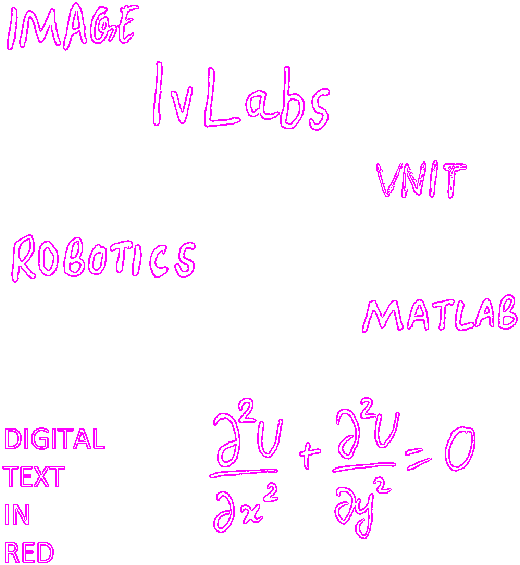

# Edge-Detection-and-Fill
This MATLAB code finds the edge of objects within an image and separately fills in a color on those detected objects.

Demo input:

Output (only outline):

Output with fill:

